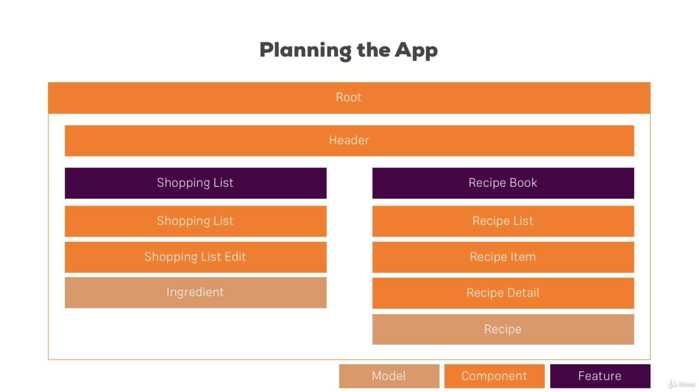

# MyFirstApp

This project was generated with [Angular CLI](https://github.com/angular/angular-cli) version 13.0.1.

## Development server

Run `ng serve` for a dev server. Navigate to `http://localhost:4200/`. The app will automatically reload if you change any of the source files.

## Code scaffolding

Run `ng generate component component-name` to generate a new component. You can also use `ng generate directive|pipe|service|class|guard|interface|enum|module`.

## Build

Run `ng build` to build the project. The build artifacts will be stored in the `dist/` directory.

## Running unit tests

Run `ng test` to execute the unit tests via [Karma](https://karma-runner.github.io).

## Running end-to-end tests

Run `ng e2e` to execute the end-to-end tests via a platform of your choice. To use this command, you need to first add a package that implements end-to-end testing capabilities.

## Further help

To get more help on the Angular CLI use `ng help` or go check out the [Angular CLI Overview and Command Reference](https://angular.io/cli) page.

---

# 03 Course Project - The Basics



### 048 Setting up the Application

- When I try to add bootstrap css framework into `angular.json`, I got error.

```json
{
  [...]
  "styles": [
    "../node_modules/bootstrap/dist/css/bootstrap.min.css",
    "src/styles.css"
  ],
  [...]
}
```

- compile error:

```shell
An unhandled exception occurred: ENOENT: no such file or directory, lstat '/Users/sarath/Public/Angular-Udemy/node_modules'
See "/private/var/folders/jm/q6lxzs_x4dx17yxzl3frkwpr0000gn/T/ng-3ixqcJ/angular-errors.log" for further details.
⠋ Generating browser application bundles (phase: setup)...%
```

- this new version of Angular, the app start at the root folder of the project instead of src, therefore, the relative path of bootstrap not required `"../node_modules/..."`.
- so the correct configuration should be

```json
{
  [...]
  "styles": [
    "./node_modules/bootstrap/dist/css/bootstrap.min.css",
    "src/styles.css"
  ],
  [...]
}
```

### 049 Creating the Components

Let try to use both approaches (manually and CLI generate) to create components

#### HeaderComponent:
- I will create header component by manually
- under the `src/app` let create new folder `header`
- then I create component files in that folder, we should get this:
```shell
.
├── header.component.html
└── header.component.ts
```
- then implement Angular component in `header.component.ts`

#### RecipesComponent:
- I will generate this component from CLI
```shell
ng generate component recipes --skip-tests true
```
- then we will need recipe-list, recipe-item and recipe-detail
```shell
ng generate component recipes/recipe-list --skip-tests true
ng generate component recipes/recipe-list/recipe-item --skip-tests true
ng generate component recipes/recipe-detail --skip-tests true
```
#### ShoppingListComponent:
- now we create the shopping list component
```shell
ng generate component shopping-list --skip-tests true
```
- then shopping list edit component
```shell
ng generate component shopping-list/shopping-edit --skip-tests true
```
- at the end of this tutorial, we should get the following `app` structure:
```shell
.
├── app.component.css
├── app.component.html
├── app.component.spec.ts
├── app.component.ts
├── app.module.ts
├── header
│   ├── header.component.html
│   └── header.component.ts
├── recipes
│   ├── recipe-detail
│   │   ├── recipe-detail.component.css
│   │   ├── recipe-detail.component.html
│   │   └── recipe-detail.component.ts
│   ├── recipe-list
│   │   ├── recipe-item
│   │   │   ├── recipe-item.component.css
│   │   │   ├── recipe-item.component.html
│   │   │   └── recipe-item.component.ts
│   │   ├── recipe-list.component.css
│   │   ├── recipe-list.component.html
│   │   └── recipe-list.component.ts
│   ├── recipes.component.css
│   ├── recipes.component.html
│   └── recipes.component.ts
└── shopping-list
    ├── shopping-edit
    │   ├── shopping-edit.component.css
    │   ├── shopping-edit.component.html
    │   └── shopping-edit.component.ts
    ├── shopping-list.component.css
    ├── shopping-list.component.html
    └── shopping-list.component.ts

```
